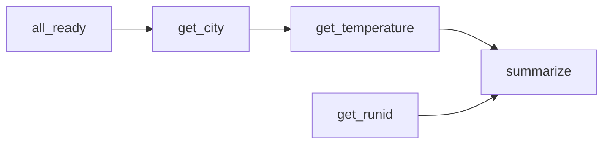

[](https://pypi.org/project/apache-airflow-flowitems)
[](https://github.com/michaelosthege/apache-airflow-flowitems/actions)
[](https://codecov.io/gh/michaelosthege/apache-airflow-flowitems)

# `apache-airflow-flowitems`
This project helps to reduce the amount of boilerplate code when writing Airflow DAGs with lots of Python callables.

For example, consider the following DAG:



From the following Python callables, there are multiple ways to create the above DAG.
But what if `weather_reports.py` is owned by another project, so we can't `@task` decorate it?

```python
# file: weather_reports.py
def get_city():
    return "London"

def get_temperature(city):
    return {
        "London": 10,
        "Paris": 15,
    }


# file: airflow_weather.py
def get_runid(context, **kwargs):
    kwargs.setdefault("city", "London")
    dagrun = context["run_id"]
    return f"{city}_{dagrun}"

def summarize(runid, temperature):
    return {
        "report_id": runid,
        "text": f"The temperature in {city} is {temperature} °C.",
    }
```

With `apache-airflow-flowitems`, the DAG definition can be very concise:

```python
from apache_airflow_flowitems import PythonItem
import weather_airflow as gluecode
import weather_reports as external

with airflow.DAG(...):
    t_ready = BashOperator(bash_command="...", task_id="all_ready")
    # Upstream dependencies can be passed as 👇 args
    t_city = PythonItem(external.get_city, t_ready)()
    # Function parameters must be passed as kwargs 👇
    t_temp = PythonItem(external.get_temperature, city=t_city)(task_id="temp_London")

    t_id = PythonItem(gluecode.get_runid)()
    t_summary = PythonItem(gluecode.summarize, runid=t_id, temperature=t_temp)
```

For comparison, the 2nd task manually wrapped in a `@task` decorator would look like this:

```python
    t_temp = task(task_id="temp_London")(external.get_temperature)(city=t_city.output)
    t_ready >> t_temp
```

Okay, it's not _that_ much shorter, but `FlowItem`s can do more cool stuff:
* Inputs can be `XComArg` or `Operator`, whereas the `@task` decorator only supports `Operator`
* If the callable passed to a `PythonItem` has a `context` argument, the Airflow `context` dict will be passed.
  In contrast to `@task`, this means that the function may ALSO take `**kwargs`.

But in the end this is, of course, just a slightly different syntax for writing DAGs.

I'm open-sourcing this package mostly to make it easier for myself to use it in different projects.

## Installation
```bash
pip install apache_airflow_flowitems
```

## Contributing
First make sure that you can run the tests:

```bash
pip install -r requirements-dev.txt
pytest --cov=./apache_airflow_flowitems --cov-report xml --cov-report term-missing .
```

Also set up `pre-commit` for automated code style enforcement:

```bash
pip install pre-commit
pre-commit install
```
